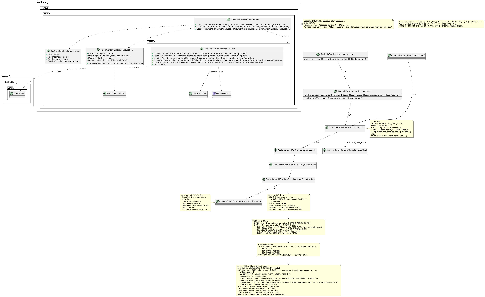

# 嗯造 XamlX

当我想出自己写一个游戏引擎的 UI 库的点子的时候，我一定是疯了。

更何况是一个...基于 XAML 的 UI 库。

本文是对 [XamlX](https://github.com/kekekeks/XamlX) 的研究过程记录。

本文是边研究边写的，就是为了记录思路——尽管可能很乱。

## 额外参考
我最开始没打算去啃 avalonia 的源码，而是想找一个尽可能小点的实现——然而压根没有。
我去 github 翻了个遍。主要筛出来的参考如下：

- https://github.com/TruDan/TruSaber
- https://github.com/alternetsoft/AlternetUI (顺带一提我是先找到的[这个](https://github.com/mmfbr/alternet-ui)
- https://github.com/OpenNefia/OpenNefia
- https://github.com/stevenbrix/xamlx-winui
- https://github.com/space-wizards/RobustToolbox

不管怎样，在此列出。没准有人需要呢。

## 从 avalonia 开始……
只不过以上这些东西我试着都看了看，然后无一例外看不懂。那还不如去看 avalonia 源码——至少这个我真用过，可能强点吧。呃……

通过检索，发现 avalonia 对 xamlx 的集成主要在 Avalonia.Markup.Xaml.Loader 和 Avalonia.Generators 项目内。

检索关键词为 "using XamlX"。这里的“提及”不代表项目中的实际引用数量——至少得除以二吧。

- [XamlLoader](https://github.com/AvaloniaUI/Avalonia/tree/master/src/Markup/Avalonia.Markup.Xaml.Loader) 提及了 124 次
- [Generator](https://github.com/AvaloniaUI/Avalonia/tree/master/src/tools/Avalonia.Generators) 提及了 24 次

此外还有 src/Avalonia.Build.Tasks 和 tests/Avalonia.Generators.Tests 中存在引用。

反正，这暂且算是够用了。

## 简阅代码结构
我首先拿GeminiCLI跑了四份代码结构报告：
- [AvaloniaMarkupDirectory](./AI_Generated_Reports/2025-9-16_AvaloniaMarkupDirectory-CodeStructureReport.md)
- [Avalonia.Markup](./AI_Generated_Reports/2025-9-16_Avalonia.Markup-CodeStructureReport.md)
- [Avalonia.Markup.Xaml](./AI_Generated_Reports/2025-9-16_Avalonia.Markup.Xaml-CodeStructureReport.md)
- [Avalonia.Markup.Xaml.Loader](./AI_Generated_Reports/2025-9-16_Avalonia.Markup.Xaml.Loader-CodeStructureReport.md)

然后边拿uml图做笔记边梳理结构。不管怎样，一图胜千言。虽然这个图不是很正规吧，但我也并非不是什么野路子。

以及，源码里面是可以进行断点测试的。

嗯，反正这样也能模模糊糊的把它大概在干啥梳理一遍吧，那我们下一步就是来复现它。

## 复现
复现仓库见 [XamlXSample](https://github.com/Bli-AIk/XamlXSample).

